# 🎮 Tres en Raya (Tic-Tac-Toe) | WinForms & Minimax AI

<div align="center">


**Una implementación moderna, modular y robusta del clásico juego Tres en Raya en .NET 10.**  
*Arquitectura desacoplada, interfaz de usuario en modo oscuro con alta responsividad, efectos de sonido nativos y un motor de Inteligencia Artificial matemáticamente invencible basado en el algoritmo Minimax.*

---

### 📸 Demostración Visual

<p align="center">
  
</p>

</div>

---

## 📑 Tabla de Contenidos

- [✨ Características Principales](#-características-principales)
- [🧠 Motor de Inteligencia Artificial (Minimax)](#-motor-de-inteligencia-artificial-minimax)
  - [Función de Evaluación con Profundidad](#función-de-evaluación-con-profundidad)
  - [Prueba Empírica y Formal de Invencibilidad](#prueba-empírica-y-formal-de-invencibilidad)
- [🏛️ Arquitectura del Software](#️-arquitectura-del-software)
  - [Diagrama de Componentes](#diagrama-de-componentes)
  - [Principios SOLID y Desacoplamiento](#principios-solid-y-desacoplamiento)
  - [Modelo Basado en Eventos](#modelo-basado-en-eventos)
- [🎨 Diseño Visual y Paleta de Colores](#-diseño-visual-y-paleta-de-colores)
- [📂 Estructura del Proyecto](#-estructura-del-proyecto)
- [🧪 Suite de Pruebas Unitarias](#-suite-de-pruebas-unitarias)
- [🛠️ Tecnologías y Requisitos](#️-tecnologías-y-requisitos)
- [🚀 Instalación y Ejecución](#-instalación-y-ejecución)
  - [Opción 1: Mediante Terminal (.NET CLI)](#opción-1-mediante-terminal-net-cli)
  - [Opción 2: Desde Visual Studio 2022](#opción-2-desde-visual-studio-2022)
  - [Opción 3: Publicación como Ejecutable Portable](#opción-3-publicación-como-ejecutable-portable-single-file)
- [📄 Licencia](#-licencia)
- [👤 Autor](#-autor)

---

## ✨ Características Principales

- 🤖 **Inteligencia Artificial Invencible (Minimax):** Motor de cálculo que evalúa recursivamente el árbol completo de jugadas. No juega de forma estocástica o aleatoria; anticipa cada respuesta del oponente para garantizar la victoria o forzar el empate.
- 👥 **Múltiples Modos de Juego:**
  - **1 Jugador vs IA:** Juega con 'X' y reta a la computadora con 'O'.
  - **2 Jugadores (Local):** Turnos alternados de humano contra humano en la misma máquina.
- 🎨 **Experiencia de Usuario Moderna (Midnight Slate Theme):**
  - Paleta de diseño contemporáneo inspirada en tonos Slate y acentos Cyan / Rose.
  - Efectos visuales de *hover* interactivo sobre las celdas y botones de acción.
  - Resaltado dinámico en verde esmeralda de la línea ganadora (horizontal, vertical o diagonal).
  - Indicador dinámico de estado en tiempo real (turno actual, victoria, empate o estado `🤖 Pensando IA...`).
- 🔊 **Feedback Auditivo Nativo:**
  - Integración nativa con `System.Media.SoundPlayer` sin requerir librerías externas de terceros.
  - Reproducción defensiva asíncrona de efectos sonoros para movimientos, fanfarria de victoria y sonido de empate.
- 📊 **Marcador Histórico Persistente:**
  - Contador de victorias para 'X', 'O' y empates acumulados durante la sesión de juego.
  - Confirmación interactiva de reinicio para prevenir pérdida accidental del puntaje.
- 📐 **Diseño Adaptativo con Alta Densidad (High-DPI):**
  - Maquetación estructurada mediante `TableLayoutPanel` que previene desajustes de coordenadas y fuentes.
  - Configurado con `ApplicationHighDpiMode.SystemAware` para nitidez absoluta en monitores 1080p, 2K y 4K.
- ⚡ **Código Limpio y Moderno:** Escrito bajo estándares de **C# 14**, con tipos de referencia anulables (`Nullable: enable`), expresiones de colección modernas, records inmutables y separación estricta de responsabilidades.

---

## 🧠 Motor de Inteligencia Artificial (Minimax)

El corazón de la IA reside en la clase `MinimaxAiPlayer`, una implementación pura y aislada del algoritmo clásico de teoría de juegos **Minimax**.

### Función de Evaluación con Profundidad

Para asegurar que la IA no solo juegue de manera óptima sino que además busque ganar en el **menor número de turnos posible** (o prolongar su defensa al máximo ante un escenario desfavorable), la función heurística asigna puntuaciones terminales ponderadas por la variable `depth` (profundidad en el árbol de recursión):

```text
               ┌── Estado Terminal de Victoria (IA gana) ──►  +10 - depth
               │
Score(s, d) ───┼── Estado Terminal de Derrota (IA pierde)  ──►  -10 + depth
               │
               └── Estado de Empate / Tablero Lleno      ──►   0
```

#### ¿Por qué es crucial la ponderación por profundidad?
1. **Priorización de victorias inmediatas:** Si la IA detecta una victoria en 1 movimiento y otra en 3 movimientos, $10 - 1 = 9$ será estrictamente mayor que $10 - 3 = 7$, decidiendo el remate inmediato.
2. **Defensa tenaz:** Si el oponente juega de manera amenazante, $-10 + 3 = -7$ es preferible frente a $-10 + 1 = -9$, forzando al oponente a ejecutar jugadas perfectas y aprovechando cualquier descuido humano.

### Prueba Empírica y Formal de Invencibilidad

La invencibilidad del algoritmo se valida formalmente mediante una suite de pruebas automatizadas:
- **Prevención de Bifurcaciones Diagonales (*Diagonal Fork*):** La IA detecta cuando el jugador intenta trampas en esquinas opuestas y responde ocupando las aristas intermedias para neutralizar la doble amenaza.
- **Teorema de Juego Perfecto (IA vs IA):** Simulaciones donde dos instancias de Minimax compiten entre sí concluyen invariablemente en empate (*Draw*).
- **Simulación Monte Carlo (50 partidas):** Ejecución de 50 partidas contra un oponente de jugadas aleatorias resultando en un 0% de derrotas para la IA.

---

## 🏛️ Arquitectura del Software

El proyecto se diseñó bajo una arquitectura desacoplada y orientada a eventos, garantizando que el motor de reglas y la lógica de inteligencia artificial sean completamente independientes de la interfaz gráfica de Windows Forms.

### Diagrama de Componentes

```mermaid
flowchart TD
    subgraph UI["Capa de Presentación (UI)"]
        MainForm["MainForm<br/>(Vista Reactiva WinForms)"]
    end

    subgraph Core["Capa de Motor y Dominio (Engine & Models)"]
        ITicTacToeGame["«interface»<br/>ITicTacToeGame"]
        TicTacToeGame["TicTacToeGame<br/>(Coordinador de Reglas y Turnos)"]
        Board["Board<br/>(Matriz 3x3 y Detección de Líneas)"]
        ScoreCard["ScoreCard<br/>(Marcador de Sesión)"]
        Player["Player<br/>(Enum X, O, None)"]
        WinLine["WinLine<br/>(Estructura de Coordenadas)"]
        GameEvents["GameEvents<br/>(Eventos Fuertemente Tipados)"]
    end

    subgraph Services["Capa de Servicios"]
        IAiPlayer["«interface»<br/>IAiPlayer"]
        MinimaxAiPlayer["MinimaxAiPlayer<br/>(Algoritmo Minimax)"]
        ISoundService["«interface»<br/>ISoundService"]
        SoundService["SoundService<br/>(Audio Nativo Windows Media)"]
    end

    MainForm -->|Invoca acciones| ITicTacToeGame
    MainForm -.->|Escucha eventos| GameEvents
    MainForm -->|Reproduce efectos| ISoundService

    TicTacToeGame -.->|Implementa| ITicTacToeGame
    TicTacToeGame --> Board
    TicTacToeGame --> ScoreCard
    TicTacToeGame --> Player
    TicTacToeGame --> WinLine
    TicTacToeGame -->|Inyecta| IAiPlayer
    TicTacToeGame -.->|Dispara| GameEvents

    MinimaxAiPlayer -.->|Implementa| IAiPlayer
    SoundService -.->|Implementa| ISoundService
    MinimaxAiPlayer -.->|Evalúa| Board
```



### Principios SOLID y Desacoplamiento

- **S (Single Responsibility Principle):** Cada clase tiene un único propósito delimitado. `Board` manipula exclusivamente las 9 casillas y valida alineaciones; `ScoreCard` solo gestiona los cómputos; `SoundService` gestiona el audio; y `MainForm` solo orquesta la visualización.
- **O (Open/Closed Principle):** Se pueden agregar nuevos motores de IA (p. ej. Algoritmo Genético, Red Neuronal o Nivel Fácil) implementando `IAiPlayer` sin modificar una sola línea del motor `TicTacToeGame`.
- **L (Liskov Substitution Principle):** Cualquier implementación de `IAiPlayer` o `ISoundService` puede ser sustituida de forma transparente.
- **I (Interface Segregation Principle):** Interfaces compactas y específicas (`ITicTacToeGame`, `IAiPlayer`, `ISoundService`).
- **D (Dependency Inversion Principle):** `MainForm` y `TicTacToeGame` dependen de abstracciones en lugar de implementaciones concretas, facilitando la prueba unitaria sin UI ni hardware de audio.

### Modelo Basado en Eventos

La interfaz de usuario es **100% reactiva**. En lugar de consultar periódicamente el estado del juego, reacciona a los eventos emitidos por `TicTacToeGame`:

| Evento | Argumentos (`EventArgs`) | Descripción |
|---|---|---|
| `MoveMade` | `MoveMadeEventArgs(cellIndex, player)` | Se dispara tras colocar una ficha válida en el tablero. |
| `TurnChanged` | `TurnChangedEventArgs(currentTurn, isAiThinking)` | Se dispara cuando el turno cambia o cuando la IA entra en fase de procesamiento. |
| `GameWon` | `GameWonEventArgs(winner, winningLine)` | Notifica la victoria, el jugador ganador y los 3 índices del tablero para resaltado. |
| `GameDrawn` | `EventArgs.Empty` | Notifica que la partida terminó en empate. |
| `ScoreChanged` | `ScoreChangedEventArgs(winsX, winsO, draws)` | Se emite para refrescar las etiquetas numéricas del marcador. |
| `RoundStarted` | `EventArgs.Empty` | Indica el inicio de una nueva ronda para limpiar el tablero visual. |

---

## 🎨 Diseño Visual y Paleta de Colores

La interfaz cuenta con un acabado visual oscuro (*Dark Mode*) diseñado para mitigar la fatiga visual y brindar un contraste limpio:

| Elemento Visual | Tono / Nombre | HEX | Muestra |
|---|---|---|:---:|
| **Fondo de Celda (Normal)** | Slate 800 | `#1E293B` | `■` |
| **Fondo de Celda (Hover)** | Slate 700 | `#334155` | `■` |
| **Borde de Celda (Normal)** | Slate 700 | `#334155` | `■` |
| **Borde de Celda (Hover)** | Slate 500 | `#64748B` | `■` |
| **Ficha Jugador X** | Electric Sky Cyan | `#38BDF8` | `■` |
| **Ficha Jugador O** | Vibrant Coral Rose | `#F43F5E` | `■` |
| **Estado IA Pensando** | Amber Warning | `#FBBF24` | `■` |
| **Línea Ganadora (Fondo)** | Emerald 900 | `#064E3B` | `■` |
| **Línea Ganadora (Texto)** | Emerald 400 | `#34D399` | `■` |
| **Línea Ganadora (Borde)** | Emerald 500 | `#10B981` | `■` |
| **Estado de Empate** | Slate 300 | `#CBD5E1` | `■` |

---

## 📂 Estructura del Proyecto

```text
TresEnRayaApp/
├── TresEnRayaApp/                       # Proyecto Principal (Windows Forms)
│   ├── Engine/                          # Motor central de juego
│   │   ├── GameEvents.cs                # Argumentos fuertemente tipados para eventos
│   │   ├── ITicTacToeGame.cs            # Contrato del motor de juego
│   │   └── TicTacToeGame.cs             # Coordinador de reglas, turnos y puntuación
│   ├── Models/                          # Entidades de dominio y estados
│   │   ├── Board.cs                     # Matriz 3x3, jugadas y 8 combinaciones ganadoras
│   │   ├── GameMode.cs                  # Modos: PlayerVsAi y PlayerVsPlayer
│   │   ├── GameState.cs                 # Estados: InProgress, Won, Draw
│   │   ├── Player.cs                    # Enum de jugadores (None, X, O) y métodos de extensión
│   │   ├── ScoreCard.cs                 # Registro histórico de victorias y empates
│   │   └── WinLine.cs                   # Tupla/Record inmutable de casillas ganadoras
│   ├── Services/                        # Servicios auxiliares
│   │   ├── IAiPlayer.cs                 # Contrato para motores de inteligencia artificial
│   │   ├── MinimaxAiPlayer.cs           # Implementación del algoritmo Minimax
│   │   ├── ISoundService.cs             # Contrato para reproducción sonora
│   │   └── SoundService.cs              # Implementación nativa con SoundPlayer de Windows
│   ├── MainForm.cs                      # Formulario principal (Lógica de vista reactiva)
│   ├── MainForm.Designer.cs             # Declaración de controles visuales
│   ├── MainForm.resx                    # Recursos embebidos de la ventana
│   ├── Program.cs                       # Punto de entrada y configuración High-DPI
│   └── TresEnRayaApp.csproj             # Definición de compilación .NET 10
│
├── TresEnRayaApp.Tests/                 # Proyecto de Pruebas Unitarias (xUnit)
│   ├── BoardTests.cs                    # 18 pruebas: límites, jugadas, victorias y reinicio
│   ├── MinimaxAiPlayerTests.cs          # 6 pruebas: victorias forzadas, bloqueo de forks y Monte Carlo
│   ├── TicTacToeGameTests.cs            # 8 pruebas: ciclo de vida, turnos, eventos y marcador
│   └── TresEnRayaApp.Tests.csproj       # Configuración de pruebas y dependencias xUnit
│
├── TresEnRayaApp.slnx                   # Archivo de solución moderna de Visual Studio
├── LICENSE                              # Licencia MIT de código abierto
└── README.md                            # Documentación integral del proyecto
```

---

## 🧪 Suite de Pruebas Unitarias

El proyecto cuenta con **32 pruebas unitarias automatizadas** basadas en el framework **xUnit**, garantizando la fiabilidad matemática del motor y la ausencia de regresiones:

```bash
dotnet test --logger "console;verbosity=detailed"
```

### Cobertura de las Pruebas

```
Passed! - Failed: 0, Passed: 32, Skipped: 0, Total: 32
```

1. **`BoardTests` (18 pruebas):**
   - Validación del estado inicial vacío y conteo de movimientos.
   - Prevención de movimientos sobre casillas ocupadas o con jugador inválido.
   - Validación estricta de índices mediante excepciones `ArgumentOutOfRangeException`.
   - Detección precisa de las **8 líneas ganadoras** (3 horizontales, 3 verticales, 2 diagonales).
   - Funcionamiento del método de clonación profunda (`Clone()`) para simulaciones de IA.
2. **`MinimaxAiPlayerTests` (6 pruebas):**
   - Validación de argumentos nulos (`ArgumentNullException`).
   - Ejecución del movimiento ganador inmediato cuando se presenta la oportunidad.
   - Bloqueo de la jugada ganadora del oponente en el siguiente turno.
   - Bloqueo estratégico de bifurcaciones diagonales (*forks*).
   - Simulación teórica IA vs IA: partida obligada a terminar en empate.
   - Simulación estadística Monte Carlo: 50 partidas consecutivas contra decisiones aleatorias sin sufrir derrotas.
3. **`TicTacToeGameTests` (8 pruebas):**
   - Inicialización correcta de la máquina de estados y marcador en ceros.
   - Alternancia de turnos y propagación de eventos `MoveMade` y `TurnChanged`.
   - Transición a estado de victoria (`GameState.Won`) y cómputo de puntaje.
   - Transición a estado de empate (`GameState.Draw`) con tablero lleno.
   - Reseteo de tablero preservando el marcador histórico entre rondas.
   - Reseteo completo del marcador tras confirmación.

---

## 🛠️ Tecnologías y Requisitos

| Componente | Especificación |
|---|---|
| **Lenguaje** | C# 14 |
| **Framework** | .NET 10.0 LTS (Windows Forms) |
| **Framework de Testing** | xUnit 2.9.3 con Microsoft.NET.Test.Sdk |
| **Sistema Operativo** | Windows 10 (versión 1903+) / Windows 11 |
| **IDE Recomendado** | Visual Studio 2022 (v17.12 o superior) / Visual Studio Code con C# Dev Kit |

---

## 🚀 Instalación y Ejecución

### Opción 1: Mediante Terminal (.NET CLI)

1. **Clonar el repositorio:**
   ```bash
   git clone https://github.com/ArielCusipumaOrtega/TresEnRaya-WinForms.git
   cd TresEnRaya-WinForms
   ```

2. **Restaurar y compilar la solución:**
   ```bash
   dotnet build
   ```

3. **Ejecutar las pruebas unitarias:**
   ```bash
   dotnet test
   ```

4. **Iniciar la aplicación:**
   ```bash
   dotnet run --project TresEnRayaApp
   ```

---

### Opción 2: Desde Visual Studio 2022

1. Abre el archivo de solución `TresEnRayaApp.slnx` en Visual Studio 2022.
2. Asegúrate de tener instalada la carga de trabajo **Desarrollo de escritorio de .NET**.
3. Selecciona la configuración `Debug` o `Release` en `Any CPU`.
4. Presiona <kbd>F5</kbd> o haz clic en **Iniciar** para depurar y jugar.
5. Puedes explorar y ejecutar todos los tests abriendo el **Explorador de pruebas** (<kbd>Ctrl</kbd> + <kbd>E</kbd>, <kbd>T</kbd>).

---

### Opción 3: Publicación como Ejecutable Portable (Single-File)

Para distribuir o ejecutar la aplicación como un único archivo `.exe` sin requerir la instalación manual del SDK de .NET:

```bash
dotnet publish TresEnRayaApp -c Release -r win-x64 --self-contained true -p:PublishSingleFile=true -o ./dist
```

El ejecutable independiente se generará en la carpeta `dist/TresEnRayaApp.exe`.

---

## 📄 Licencia

Este proyecto se encuentra bajo la licencia de código abierto **MIT**. Consulta el archivo [LICENSE](LICENSE) para obtener más detalles.

---

## 👤 Autor

Desarrollado con dedicación por **Ariel Cusipuma Ortega**.

- GitHub: [@ArielCusipumaOrtega](https://github.com/ArielCusipumaOrtega)
- Repositorio: [TresEnRaya-WinForms](https://github.com/ArielCusipumaOrtega/TresEnRaya-WinForms)

---

<div align="center">
  <sub>⭐ Si este proyecto te resulta útil o interesante, ¡no dudes en dejar una estrella en el repositorio!</sub>
</div>
